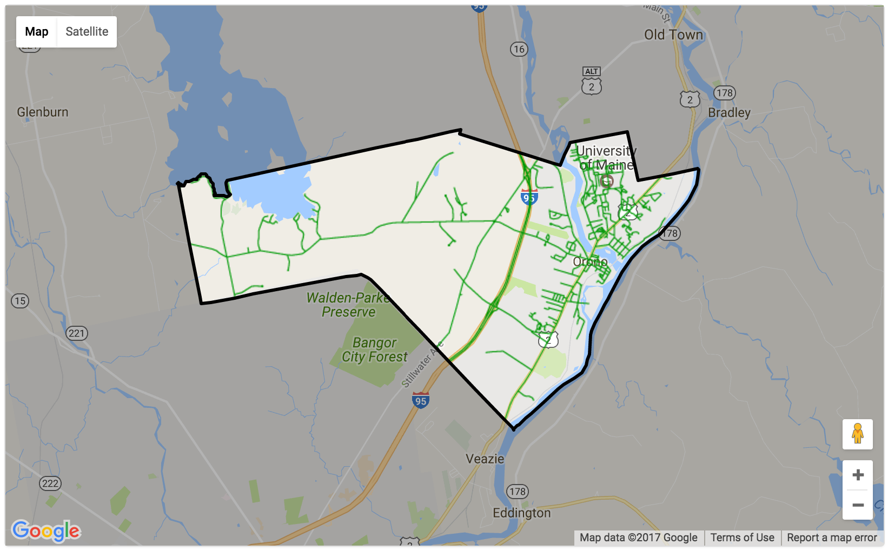

# 

## Introduction

This is a mapping application that allows the citizens of Orono, Maine to report **non-emergency** problems to various town office departments.

## Usage

Users must log in to use the application, so as to prevent spamming, and abuse. The user is asked to sign up for an account by entering a username, a password and an email. An email will be sent to the user with a confirmation link. After logging in, the user is presented with a map of Orono, and is geolocated via their browser. If the user has disabled geolocation, or if they are not at the location of the issue, they can click on the map to locate their issue.

The user is associated with the problem for contact and status updates. They are prompted to enter a description of the problem, and to select a type of problem to report. 

The application supports the problem types by default: 
* Pothole
* Street Light Issue
* Fire Hydrant Issue
* Grafitti or Vandalism
* Trash
* Excessive Noise
* Other

Others can easily be added; see the **Installation** section below.

## Installation

To keep things portable, we are using [MAMP](https://www.mamp.info/en/) for our database (MySQL) and webserver. To use, serve the `page/` directory of this project.

You will first need to set up the database, which you can do by importing [`/sql/ORONOISSUE.sql`](/sql/ORONOISSUE.sql).

After setting up the database, you might want to add more problem types for users to report. Seven are included, but more can easily be added. The database will have a table called `tbl_problem_types`. To add a new problem type, insert a new row into this table with a name and an optional filename for the image used as its icon on the map (relative to `/assets/icons/png/`). If none is specified, the "Other" category's icon is used.

## Developers 

To develop with this application, you will need to download and install MAMP (or a similar package that supports MySQL / Php 7.0). You can use the [`/sql/ORONOISSUE.sql`](/sql/ORONOISSUE.sql) file to create the database, or [`test.sql`](/sql/test.sql) to include some prepopulated data. 

* Put the contents of this project anywhere in your `htdocs` directory in MAMP.
* Create a user for the database called testUser (or create your own user, and update `phpmsqlinfo.php` and `dbinfo.php` with the new information).
* Make sure that MAMP's webserver tab is pointed to the `pages` directory.
* Note: you may need to change the default ports in MAMP depending on what your configuraton is. It is by default at 8888. 

### More Info

[PhpMailer](https://github.com/PHPMailer/PHPMailer) is is used for sending email validation of users along with a Gmail account to serve as the messenger. We use the Google Maps JavaScript API to serve the map, display problems, and to display our KML layers for styling the map.